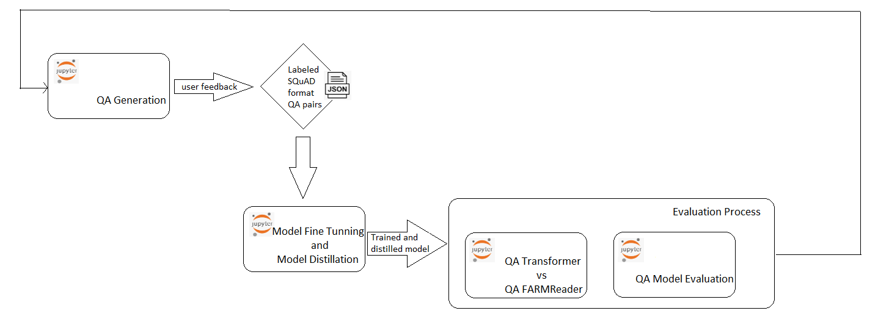

### QA Process Improvement
**QA Generation** *(QuestionAnswersGeneration.ipynb)* notebook generates a json in ``SQuAD`` format, containing (question, answer) pairs based on ``EEA`` documents.

EEA Subject Matter Experts or other appropriate users give their feedback on the generated (question, answer) pairs and this way it is obtained a ``SQuAD formatted json`` file that can be used for creating the EEA specific trained model.

**QA Transformers vs QA FARMReader** *(QA Transformers vs QA FARMReader.ipynb)* notebook can be used to compare different ``QA models`` (e.g. deepset/minilm-uncased-squad2, deepset/roberta-base-squad2, etc.), working both with ``Transformer Reader`` and with ``FARMReader Reader``.

In comparison,  ``FARMReader`` is used as reference Reader and ``deepset/roberta-base-squad2`` as reference model.

The comparison is done on speed and on accuracy.

After the creation of the EEA specific trained model, it will be able to also compare it with the other existing models.

Also, for evaluation purposes, the **QA Model Evaluation** notebook (*QAModelEvaluator.ipynb*) can be used. This notebook was created based on the tutorial from https://haystack.deepset.ai/docs/latest/tutorial5md .

The creation of the, EEA specific, trained model, will be done by using **QAFineTuning** (*QAFineTuning.ipynb*) notebook created based on the tutorial from https://haystack.deepset.ai/docs/latest/tutorial2md .
First the model will be fine tuned, then the fined tuned model will be distilled.

### QA System Improvement Diagram

